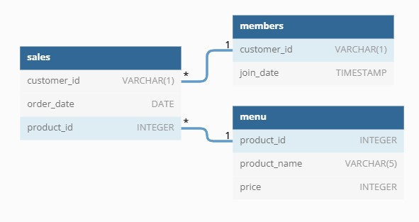

# SQL-Challenge
Case Study 1 Question from #8WeekSQLChallenge by Danny Ma
(https://8weeksqlchallenge.com/case-study-1/)

## IntroductionDanny seriously loves Japanese food so in the beginning of 2021, he decides to embark upon a risky venture and opens up a cute little restaurant that sells his 3 favourite foods: sushi, curry and ramen.

Danny’s Diner is in need of your assistance to help the restaurant stay afloat - the restaurant has captured some very basic data from their few months of operation but have no idea how to use their data to help them run the business.

## Dataset
Key datasets for this case study
- **sales** : The sales table captures all customer_id level purchases with an corresponding order_date and product_id information for when and what menu items were ordered.
- **menu** : The menu table maps the product_id to the actual product_name and price of each menu item.
- **members** : The members table captures the join_date when a customer_id joined the beta version of the Danny’s Diner loyalty program.

## Entity Relationship Diagram

