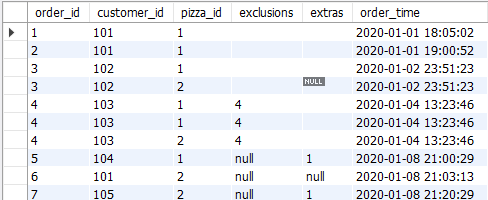
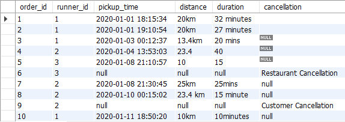
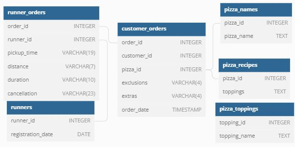
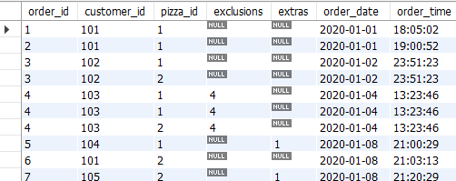
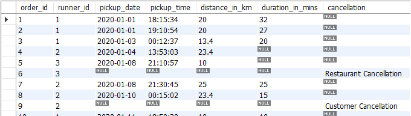

# SQL-Challenge
Case Study 2 question and answers from #8WeekSQLChallenge by Danny Ma
(https://8weeksqlchallenge.com/case-study-2/)

## Introduction
Danny was scrolling through his Instagram feed when something really caught his eye - “80s Retro Styling and Pizza Is The Future!”

Danny was sold on the idea, but he knew that pizza alone was not going to help him get seed funding to expand his new Pizza Empire - so he had one more genius idea to combine with it - he was going to Uberize it - and so Pizza Runner was launched!

Danny started by recruiting “runners” to deliver fresh pizza from Pizza Runner Headquarters (otherwise known as Danny’s house) and also maxed out his credit card to pay freelance developers to build a mobile app to accept orders from customers.

## Dataset
Key datasets for this case study
- **runners** : The table shows the registration_date for each new runner
- **customer_orders** : Customer pizza orders are captured in the customer_orders table with 1 row for each individual pizza that is part of the order. The pizza_id relates to the type of pizza which was ordered whilst the exclusions are the ingredient_id values which should be removed from the pizza and the extras are the ingredient_id values which need to be added to the pizza.
- **runner_orders** : After each orders are received through the system - they are assigned to a runner - however not all orders are fully completed and can be cancelled by the restaurant or the customer. The pickup_time is the timestamp at which the runner arrives at the Pizza Runner headquarters to pick up the freshly cooked pizzas. The distance and duration fields are related to how far and long the runner had to travel to deliver the order to the respective customer.
- **pizza_names** : Pizza Runner only has 2 pizzas available the Meat Lovers or Vegetarian!
- **pizza_recipes** : Each pizza_id has a standard set of toppings which are used as part of the pizza recipe.
- **pizza_toppings** : The table contains all of the topping_name values with their corresponding topping_id value

## Data Clean
There are some known data issues with few tables. Data cleaning was performed and saved in temporary tables before attempting the case study.

**customer_orders table**

- The order_time needs to be separated by time and date respectively
- The exclusions and extras columns have blanks and null values, hence needing to standardize the null values. 

**runner_orders table**

- The pickup_time needs to be separated by time and date respectively. 
- The pickup_time, distance, duration and cancellation columns have blanks and null values, hence needing to standardize the null values.
- In the distance and duration column, they contain their own units of measurement - km and mins/minutes. These must be removed.
- The distance and duration column has to be converted to proper value. 

## Entity Relationship Diagram

## Conclusion
**new_customer_orders table**

**new_customer_orders table**

